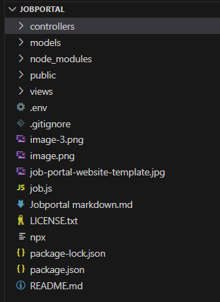
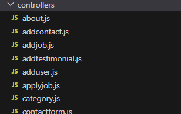
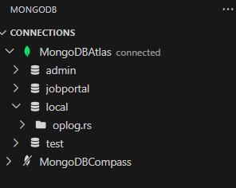
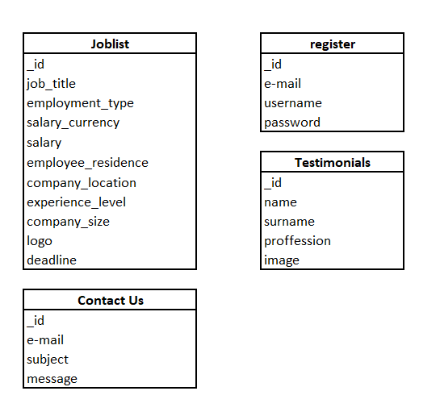

# Graduates Job Portal
**Project Title:** Graduates Job Portal  
**Author:** Eugenia Stanciu  
**Date:** February 2, 2024  
**Website (cyclic):** [Graduates Job Portal](https://graduatesjobportal.cyclic.app)  
**Website (render):** [Graduates Job Portal](https://graduatesjobportal.cyclic.app)
**GitHub Repository:** [Job Portal GitHub](https://eugenia-stanciu.onrender.com/)

## Table of Contents
1. [Introduction](#introduction)
2. [Background and Inspiration](#background-and-inspiration)
3. [Project Overview](#project-overview)
    - [Graduate Job Portal - Design](#job-portal-design)
    - [Database Design](#database-design)
    - [Security and Scalability](#security-and-scalability)
4. [Conclusions and Reflection](#conclusions-and-reflection)
    - [Achievements and Milestones](#achievements-and-milestones)
    - [Insights Gained](#insights-gained)
    - [Prospects](#prospects)

## Introduction
In today's fast-paced world characterized by rapid technological advancements and a dynamic job market, recent graduates often face a challenging transition from academia to the professional domain. To address these challenges, the Graduates Job Portal project aims to facilitate connections between graduates and potential employers. Many students struggle to find suitable employment immediately after completing their studies, primarily due to a lack of experience and professional networks.

## Background and Inspiration
The "Graduates Job Portal" provides a straightforward platform where students can showcase their skills and connect with potential employers, easing the journey from studies to employment.

The creation of this dedicated platform for graduates derived from the need to systematically address a common issue. Statistical data highlights that a significant number of recent graduates experience extended periods of unemployment or difficulty finding positions that align with their qualifications. The primary goal of the Graduates Job Portal is to break this cycle, offering employers an opportunity to discover hidden talent while empowering graduates to effectively showcase their skills and untapped potential.

Figure 1: Screenshot of the Job Portal main webpage

## Project Overview
The project's significance lies in its ability to provide a dedicated space for fresh graduates to navigate the paradox of needing experience to secure a job and requiring a job to gain experience. This innovative platform empowers graduates to showcase their talents, making them visible to employers. 

### Job Portal Design
The Graduate Job Portal functions as a Node.js application, utilizing Express, Mongoose, and the EJS templating engine. Designed specifically for online job-seeking, especially post-graduation, its core purpose is to assist students in their job search process.

The Graduates Job Portal empowers users with the ability to seamlessly execute CRUD operations, enabling them to Create, Read, Update, and Delete job listings on MongoDB, Mongo DB Compass and MongoDB Atlas. Users can leverage the platform to create new job listings, contact submissions, user registrations, and testimonials. The Read operation allows users to access and review the comprehensive job list or their experience on the Graduate Job Portal. Additionally, the platform facilitates users in updating existing job listings and, if needed, deleting specific job entries, ensuring a dynamic and user-friendly experience.

  
Figure 2: Screenshot of the Job Portal Interface

Outlined below are the essential features of this application:

1. **Server Configuration:** Express is employed to set up the server, facilitating functions such as providing access to static files, creating user sessions for authentication, and allowing users to upload files. The connection to MongoDB, managed by Mongoose, prioritizes security by obtaining the connection URI from environment variables. The 'JobList' model is incorporated to structure and organize job-related data. Additionally, the global variable 'loggedIn' is initiated and dynamically updated through middleware based on user sessions.

2. **View Rendering:** EJS serves as the chosen view engine for creating dynamic and interactive interfaces. Routes and controllers play a central role in managing various tasks, from displaying different web pages to processing data. The application collaborates with the 'JobList' model to oversee job-related data, and a designated endpoint ('/joblist') facilitates the exchange of job list items in JSON format. 
Analogous models were generated for 'Users,' 'Contact Us,' and 'Testimonials' to define the attributes of the database collections.

  
Figure 3: JobPortal controllers

3. **Functionality Handling:** Routes and controllers are established to handle different aspects, including job applications, contact forms, and user registration, load different forms for deleting, updating and retrieving data.  An effective error-handling system, featuring a '404 not found page', is implemented to address instances of undefined routes. The server configuration involves attentive listening on a specified port and hostname, enhancing adaptability and deployment options.

4. **Logging Operations:** Logging, performed through console logs, serves to provide crucial feedback, indicating successful database connections and server startup. Jobportal proves to have a good web server architecture using Express, with a focus on user authentication, seamless file uploads, and strategic interactions with MongoDB for effective management of job-related information.

### Database Design
Job Portal uses the MongoDB database (MongoDB, MongoDB Atlas, MongoDB Compass). MongoDB is classified as a NoSQL database, suitable for applications with large amounts of unstructured or semi-structured data. The Job Portal database has distinct features compared to a SQL-type database:

- **Flexible Schema:** Allows dynamic and flexible schema design, accommodating variations in data structure.
- **Document-Oriented:** Data is stored in BSON (binary JSON) documents, making it easy to represent complex relationships.
- **Scalability:** Job Portal is horizontally scalable, supporting the growth of data and high traffic.

  
Figure 4: JobPortal MongoDB connections

The job database was downloaded from https://www.kaggle.com/datasets/ruchi798/data-science-job-salaries, small changes and ammendments  like removing some columns so that it will display only UK based vacancies. 

The Job Portal Database is structured into five collections: joblist, jobdept, register, contactus and testimonials. These collections are utilized to store data from a JSP form using models. Models encapsulate the data structure, validation rules, and database interactions, promoting a clean and organized approach to working with MongoDB in a Node.js application.

  
Figure 5: JobPortal database design

### Security and Scalability
Job Portal prioritizes both security and scalability to ensure a robust and reliable platform.

#### Security Measures
Job Portal employs a comprehensive set of security measures to safeguard user data and maintain the integrity of the system. This includes, but is not limited to:

- **Data Encryption:** Utilizing industry-standard encryption algorithms, sensitive information such as passwords undergo encryption for enhanced security during transmission and storage. The implementation involves the 'bcrypt' library, as showcased in the login controller
- **Authentication and Authorization:** Robust authentication mechanisms verify the identity of users, and authorization controls ensure that users have appropriate access levels.
- **Regular Security Audits:** Periodic security audits are conducted to identify and address potential vulnerabilities. This proactive approach helps in staying ahead of evolving security threats.

#### Scalability Strategies
Ensuring scalability is crucial for handling the growth of data and traffic. Job Portal adopts the following strategies for scalability:

- **Horizontal Scaling:** Job Portal is designed to horizontally scale, allowing the system to handle increased load by adding more resources or nodes. This ensures optimal performance during peak times.
- **Load Balancing:** Load balancing is a mechanism that allocates incoming traffic across multiple servers, preventing the occurrence of a single server as a bottleneck. This strategy contributes to the overall enhancement of application performance and availability.
- **Caching Mechanisms:** Employing caching mechanisms reduces the load on databases by storing frequently accessed data in memory. This improves response times and contributes to overall scalability.
- **Resource Monitoring and Auto-Scaling:** Continuous monitoring of system resources enables automatic scaling based on demand. Auto-scaling ensures that the application can adapt to varying workloads efficiently.

By combining robust security practices with scalable architecture, Job Portal aims to provide a secure and seamless experience for users while accommodating the growth and demands of the platform.

## Conclusions and Reflection
The development of Job Portal has been a dynamic and cyclic  process, involving: planning, implementation, testing and improvment.

### Achievements and Milestones
The successful establishment of the Graduates Job Portal marks a notable achievement. Serving as a pivotal link between graduates and potential employers, it significantly enhances the accessibility of job searching. Key accomplishments encompass:

- **User-Focused Design:** The project prioritized crafting an intuitive and seamless experience for both job seekers and employers, emphasizing user satisfaction and ease of navigation.
- **Robust Functionality:** The Job Portal stands out for its comprehensive functionality, offering vital features such as detailed job listings, streamlined application processes, and a secure userauthentication system.
- **Security Measures:** A focal point of the project has been ensuring the security of user information. This commitment is reflected in the implementation of rigorous security measures, including data encryption and regular security audits.
- **Scalability:** Proactively addressing the potential for growth, the Job Portal is strategically designed for scalability. This ensures optimal performance, even in scenarios of heightened user traffic, demonstrating a commitment to accommodating increasing demands.

### Insights Gained
This project provided valuable insights into web development, database design, and system scalability.

The project stands out with the following features:

- **Adaptability:** Being adaptable and open to changes based on feedback and evolving requirements is crucial.
- **Collaboration:** Effective collaboration among team members and stakeholders is vital for a cohesive development process.
- **Continuous Improvement:** Embracing continuous improvement allows for ongoing enhancements to the project.

### Prospects
Job Portal reflects a commitment to innovation and effective problem-solving. Future opportunities for improvement include the addition of advanced search features, personalized user dashboards, and enhanced tools for employers. Staying updated with emerging technologies will further enhance the platform's performance, security, and user experience. Job Portal is not just a functional tool; it serves as a promoter for connecting graduates with opportunities, providing a foundation for successful career transitions in the future. The Job Portal is horizontally scalable, with numerous enhancements planned for vertical scalability. These improvements include the ability to submit job applications, save CVs and cover letters, and enable job applicants to create a personal job seeker profile.