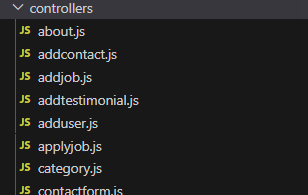
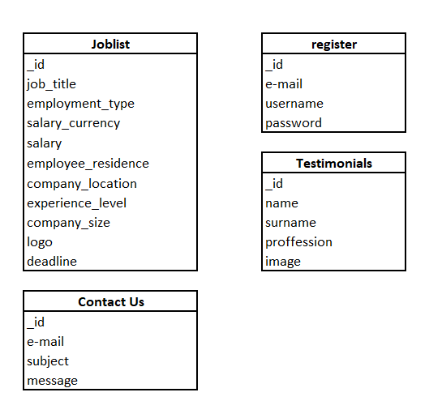

# Graduates Job Portal
**Project Title:** Graduates Job Portal
**Author:** Eugenia Stanciu  
**Date:** February 2, 2024  
**Website:** [Graduates Job Portal](https://graduatesjobportal.cyclic.app)  
**GitHub Repository:** [Job Portal GitHub](https://github.com/EugeniaBD/jobportal.git)

---

# Table of Contents

1. [Introduction](#introduction)
2. [Background and Inspiration](#background-and-inspiration)
3. [Project Overview](#project-overview)
4. [Graduate Job portal - design](#job_portal_design)
5. [Database Design](#database_design)
6. [Security and Scalability](#security_and_scalability)
7. [Conclusions and Reflection](#conclusions_and_reflection)

# Introduction 

In the current world, marked by fast technological progress and a constantly changing job market, recent graduates face a tough transition from school to work. To address these challenges, the Graduates Job Portal project is helping graduates connect with potential employers. A significant number of students find it challenging to secure suitable jobs right after finishing their studies, mainly because they lack experience and professional connections.

The Graduates Job Portal originated from recognizing a clear gap between the expectations of new graduates and what employers seek. Many graduates find themselves in a challenging position, needing job experience to secure a position while simultaneously requiring a job to acquire that experience. This reality, combined with the untapped potential and frustration experienced by numerous graduates, became the driving force behind the creation of this transformative project.

# Background and Inspiration 

The "Graduates Job Portal"  provides a simple platform where students can display their skills and connect with potential employers, making the journey from studies  to employment smoother. 

The creation of a special platform for graduates was driven by the goal to systematically tackle a common problem. Statistics show that a considerable number of recent graduates experience long periods of unemployment or have difficulty finding jobs that match their qualifications. The main purpose of the Graduates Job Portal is to break this cycle. It aims to give employers an easy way to find hidden talent while empowering graduates to effectively showcase their skills and untapped potential. 

# Project Overview 

The project's importance lies in its ability to provide a dedicated space for fresh graduates to break the paradoxical cycle of needing experience to secure a job and needing a job to gain experience. This innovative platform empowers  graduates to showcase their talents, making them visible to employers eager to discover untapped potential.

# Job Portal Design

The Graduate Job Portal functions as a Node.js application, employing Express, Mongoose, and the EJS templating engine. Designed specifically as an online platform for job-seeking, especially post-graduation, its core purpose is to assist students in their job search endeavors.

**Figure 1: Screenshot of the Job Portal Interface**

Outlined below are the essential features of this application:

**1. Server Configuration:** Express is used to set up the server, facilitating crucial functions such as providing access to static files, creating user sessions for  uthentication, and allowing users to upload files. The connection to MongoDB, managed by Mongoose, focuses on security by obtaining the connection URI from environment variables. The 'JobList' model is incorporated to structure and organize job-related data. Additionally, the global variable 'loggedIn' is initiated and dynamically updated through middleware based on user sessions.

**2. View Rendering:** EJS serves as the chosen view engine for creating dynamic and interactive interfaces. Routes and controllers play a pivotal role in managing various tasks, from displaying different web pages to processing data. The application collaborates with the 'JobList' model to oversee job-related data, and a designated endpoint ('/joblist') facilitates the exchange of job list items in JSON format.

**Figure 2: Controllers of the Job Portal Interface**

**3.Functionality Handling:** Routes and controllers are established to handle different aspects, including job applications, contact forms, and user registration. An effective error-handling system, featuring a 404 not found page, is implemented to address instances of undefined routes. The server configuration involves attentive listening on a specified port and hostname, enhancing adaptability and deployment options.

**4.Logging Operations:** Logging, performed through console logs, serves to provide crucial feedback, indicating successful database connections and server startup. Overall, the codebase constructs a resilient web server architecture using Express, with a focus on user authentication, seamless file uploads, and strategic interactions with MongoDB for effective management of job-related information.

# Database Design 

Job Portal uses Mongo DB data base (MongoDB Altlas, Mongo DB Compass).MongoDB is classified as a NoSQL database, suitable for applications with large amounts of unstructured or semi-structured data. Compared to a SQL type database, Jobportal database has few distinguishfeatures:

**Flexible Schema:** allows dynamic and flexible schema design, accommodating variations in data structure.

**Document-Oriented:** Data is stored in BSON (binary JSON) documents, making it easy to represent complex relationships.

**Scalability:** Jobportal is horizontally scalable, supporting the growth of data and high traffic.

**NoSQL:** Jopportal database is classified as a NoSQL database, suitable for applications with large amounts of unstructured or semi-structured data.

Job Portal Database is structured in 4 collections : joblist, jobdept, register and testimonials. 
The following are the collections utilized to store data from a JSP form using models. Models encapsulate the data structure, validation rules, and database interactions, promoting a clean and organized approach to working with MongoDB in a Node.js application.

# Security and Scalability 

**Security and Scalability:** Jobportal prioritizes both security and scalability to ensure a robust and reliable platform.

## Security Measures

Jobportal employs a comprehensive set of security measures to safeguard user data and maintain the integrity of the system. This includes, but is not limited to:

- **Data Encryption:** Sensitive information is encrypted using industry-standard encryption algorithms, ensuring confidentiality during transmission and storage.

- **Authentication and Authorization:** Robust authentication mechanisms verify the identity of users, and  authorization controls ensure that users have appropriate access levels.

- **Regular Security Audits:** Periodic security audits are conducted to identify and address potential vulnerabilities. This proactive approach helps in staying ahead of evolving security threats.

## Scalability Strategies

Ensuring scalability is crucial for handling the growth of data and traffic. Jobportal adopts the following strategies for scalability:

- **Horizontal Scaling:** Jobportal is designed to horizontally scale, allowing the system to handle increased load by adding more resources or nodes. This ensures optimal performance during peak times.

- **Load Balancing:** Load balancing distributes incoming traffic across multiple servers, preventing any single server from becoming a bottleneck. This enhances the overall performance and availability of the application.

- **Caching Mechanisms:** Employing caching mechanisms reduces the load on databases by storing frequently accessed data in memory. This improves response times and contributes to overall scalability.

- **Resource Monitoring and Auto-Scaling:** Continuous monitoring of system resources enables automatic scaling based on demand. Auto-scaling ensures that the application can adapt to varying workloads efficiently.

By combining robust security practices with scalable architecture, Jobportal aims to provide a secure and seamless experience for users while accommodating the growth and demands of the platform.

# Conclusions and Reflection 

 The development of the Jobportal has been a dynamic process, involving planning, implementation, and refinement.

## Achievements and Milestones
The successful establishment of the Graduates Job Portal marks a noteworthy achievement. Serving as a pivotal link between graduates and potential employers, it significantly enhances the accessibility of job searching. Key accomplishments encompass:

- **User-Focused Design:** he project prioritized crafting an intuitive and seamless experience for both job seekers and employers, emphasizing user satisfaction and ease of navigation.

- **Robust Functionality:** The Job Portal stands out for its comprehensive functionality, offering vital features such as detailed job listings, streamlined application processes, and a secure user authentication system.

- **Security Measures:** A focal point of the project has been ensuring the security of user information. This commitment is reflected in the implementation of rigorous security measures, including data encryption and regular security audits.

- **Scalability:** Proactively addressing the potential for growth, the Job Portal is strategically designed for scalability. This ensures optimal performance, even in scenarios of heightened user traffic, demonstrating a commitment to accommodating increasing demands.

## Insights Gained
This project provided valuable insights into web development, database design, and system scalability. 

- **Adaptability:** Being adaptable and open to changes based on feedback and evolving requirements is crucial.

- **Collaboration:** Effective collaboration among team members and stakeholders is vital for a cohesive development process.

-**Continuous Improvement:** Embracing continuous improvement allows for ongoing enhancements to the project.

## Prospects

As this phase concludes, the Jobportal reflects a commitment to innovation and effective problem-solving. Future opportunities for improvement include the addition of advanced search features, personalized user dashboards, and enhanced tools for employers. Staying updated with emerging technologies will further enhance the platform's performance, security, and user experience. The Jobportal is not just a functional tool; it serves as a promoter for connecting graduates with opportunities, providing a foundation for successful career transitions in the future.

